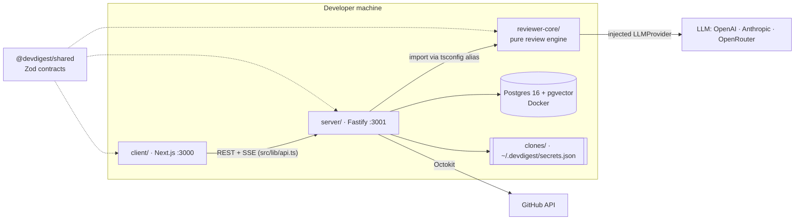
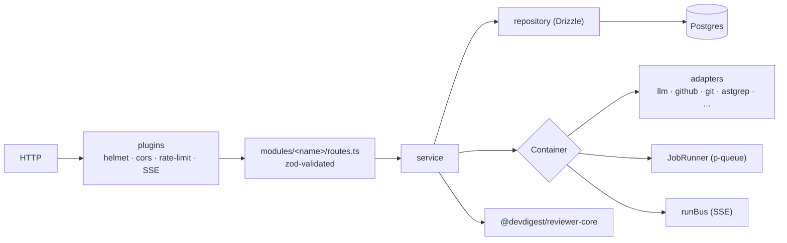

# DevDigest onboarding

You are onboarding a **new engineer** to this repository. Your job is to give them
an accurate mental model in ~15 minutes of reading, then point them at the code to
read next. Write for a competent TypeScript developer who has never seen this repo.

## Ground rules

1. **Verify before you state.** The "Baseline" section below is a snapshot and
   may be stale. Before putting any fact in your answer (a port, a file path, a
   module name, a table, a dependency), confirm it with `ls`, `grep`, or by
   reading the file. If the code disagrees with the baseline, trust the code and
   say what changed.
2. **Cite files** as `path/to/file.ts` (with `:line` where useful) so the reader
   can click through.
3. **Explain the *why*,** not only the *what* — e.g. why reviewer-core has no DB
   access, why modules are registered statically, why grounding exists.
4. **Don't dump the READMEs.** Synthesize; link to them for depth.
5. Reply in the language the user wrote in.

## Output structure

Produce these sections, in this order:

1. **What DevDigest is** — goal and purpose in 3–5 sentences (who uses it, what
   problem it solves, what "local-first" means here, that this is a course
   starter that later lessons extend).
2. **Tech stack** — a table: layer → technology → where it lives.
3. **Repository layout** — an annotated tree of the top-level folders and the
   important sub-folders (no more than ~40 lines).
4. **How the packages connect** — a Mermaid diagram of packages + external
   systems, then a short explanation of *how* code is shared (tsconfig path
   aliases, not a workspace/published packages).
5. **Inside the server** — a Mermaid diagram of request → plugins → module →
   service → DI container → adapters / DB, plus a table of the feature modules
   and what each owns.
6. **The core flow, end to end** — a Mermaid `sequenceDiagram` for
   *add repo → clone → index → import PRs → run review → findings in UI*.
7. **Data model** — the main tables grouped by domain, and which ones are empty
   in the starter (filled by later lessons).
8. **Running it locally** — the minimal commands, and the gotchas from
   "Known sharp edges" that are still true (re-check each one).
9. **Testing & CI** — suites, how the unit/integration split works, workflows.
10. **Where to start reading** — an ordered reading path of 8–10 files, one line
    each on why.
11. **First-week tasks** — 3–5 small, concrete starter tasks tied to real code.

Keep diagrams small enough to read (≤ ~15 nodes each). Prefer several focused
diagrams over one giant one.

## Baseline (snapshot — verify before use)

### Purpose

DevDigest is a **local-first AI pull-request reviewer**. A developer adds a
GitHub repo, the server clones and indexes it, imports open PRs, and runs one or
more **agents** (an LLM + system prompt) over a PR diff. The output is
**structured findings** (severity, score, cited line) that pass a mechanical
**grounding gate** so hallucinated locations are dropped. Everything runs on the
developer's machine; the only outbound calls are GitHub and the LLM provider.
This repo is the **course starter**: it does one flow end to end, and each lesson
(L01–L08 in `README.md`) adds a feature back as a new server module.

### Packages (no monorepo workspace — each has its own `package.json` + lockfile)

| Folder | Package | Role | Port |
|---|---|---|---|
| `client/` | `@devdigest/web` | Next.js 15 studio UI (pnpm) | 3000 |
| `server/` | `@devdigest/api` | Fastify 5 API + Drizzle/Postgres (pnpm) | 3001 |
| `reviewer-core/` | `@devdigest/reviewer-core` | Pure review engine, no DB/FS/GitHub (npm) | — |
| `server/src/vendor/shared` | `@devdigest/shared` | Zod contracts + adapter interfaces | — |
| `client/src/vendor/ui` | `@devdigest/ui` | Vendored UI primitives | — |
| `e2e/` | `@devdigest/e2e` | Deterministic browser e2e (agent-browser) | — |

Code sharing is via **tsconfig `paths`** (check `server/tsconfig.json`,
`client/tsconfig.json`, `reviewer-core/tsconfig.json`):
- server → `@devdigest/reviewer-core` = `../reviewer-core/src` (raw TS source)
- server & reviewer-core → `@devdigest/shared` = `server/src/vendor/shared`
- client → `@devdigest/shared` = **its own copy** in `client/src/vendor/shared`

### Tech stack

- **Server:** Node ≥ 22, TypeScript, Fastify 5 (`helmet`, `cors`, `rate-limit`,
  `fastify-sse-v2`), `fastify-type-provider-zod`, Drizzle ORM + `postgres`,
  Postgres 16 + pgvector (Docker), `p-queue` job runner, Octokit, `simple-git`,
  `@ast-grep/napi`, `dependency-cruiser`, `graphology` (PageRank), `js-tiktoken`,
  ripgrep, OpenAI / Anthropic SDKs, OpenRouter (in reviewer-core).
- **Client:** Next.js 15 App Router, React 19, TanStack Query, `next-intl`,
  Tailwind 4, `recharts`, `mermaid`, `react-markdown`.
- **Tests:** Vitest everywhere; `@testing-library/react` + jsdom (client);
  testcontainers Postgres (server `*.it.test.ts`); agent-browser (e2e).
- **CI:** `.github/workflows/{client,server-unit,server-integration,reviewer-core,e2e-web}.yml`, path-filtered.

### Package map



### Server internals

- Entry: `server/src/server.ts` → `server/src/app.ts` (plugins registered
  **before** modules so they inherit helmet/cors/rate-limit/SSE/error handler).
- Modules registered statically in `server/src/modules/index.ts`:
  `settings`, `repos`, `pulls`, `polling`, `workspace`, `agents`, `reviews`,
  `repoIntel`. Each is `modules/<name>/routes.ts` (+ `service.ts`,
  `repository.ts`, `helpers.ts`, `constants.ts` where needed).
- **Composition root / DI:** `server/src/platform/container.ts` — config, db,
  `JobRunner`, SSE `runBus`, lazily built adapters, shared repositories
  (`agentsRepo`, `reviewRepo`), `repoIntel` facade. Tests pass
  `ContainerOverrides` (see `server/src/adapters/mocks.ts`).
- **Adapters (ports → impls)** in `server/src/adapters/`: `llm/`, `github/`,
  `git/`, `codeindex/` (ripgrep), `astgrep/`, `depgraph/`, `tokenizer/`,
  `embedder/`, `secrets/`, `auth/`. Interfaces live in
  `server/src/vendor/shared/adapters.ts`.
- **Async work:** `server/src/platform/jobs.ts` — p-queue + `jobs` table with
  timeout/retry. Clone → index jobs are enqueued from `modules/repos/service.ts`.
- **Reviews:** route `POST /pulls/:id/review` → `ReviewService.runReview`
  (`modules/reviews/service.ts`) creates run rows and fires
  `ReviewRunExecutor.executeRuns` (`modules/reviews/run-executor.ts`) **without
  awaiting**; progress streams over SSE (`/runs/:id/events`), and the trace is
  persisted (`/runs/:id/trace`).
- **repo-intel** (`server/src/modules/repo-intel/`, see its README): pipeline
  `walk → ast-grep symbols → dependency-cruiser import graph → PageRank rank →
  repo map`, stored in Postgres; consumers read only via the `repoIntel.*`
  facade. Gated by `REPO_INTEL_ENABLED` and a per-agent `repo_intel` flag.



### Review engine (`reviewer-core/src/`)

`review/run.ts` (`reviewPullRequest`) → `prompt.ts` (`assemblePrompt`,
`wrapUntrusted`, `INJECTION_GUARD`) → injected `LLMProvider`
(`llm/openrouter.ts`) → `llm/structured.ts` (Zod → JSON Schema, parse-with-repair)
→ `grounding.ts` (`groundFindings`: drop findings whose line is not in the diff;
score recomputed from survivors). Optional slots (skills, memory, specs, callers,
`reduce()`, `toReview()`) are wired by later lessons.

### Client (`client/src/`)

Routes in `src/app/**/page.tsx`: `/`, `/onboarding`, `/repos/[repoId]/pulls`,
`/repos/[repoId]/pulls/[number]` (overview · diff · findings · run trace),
`/agents`, `/agents/[id]`, `/settings/[section]`. Data hooks in
`src/lib/hooks/*` over `src/lib/api.ts` (`NEXT_PUBLIC_API_BASE`). Feature UI is
colocated in `_components/<Name>/` with a sibling `*.test.tsx`. Shell/nav in
`src/components/app-shell`, diff UI in `src/components/diff-viewer`.

### Data model (`server/src/db/schema/*.ts`, migrations in `server/src/db/migrations`)

The schema already contains **every** course table; many are empty in the
starter. Group them by file (`core`, `repos`, `pulls`, `agents`, `reviews`,
`runs`, `repo-intel`, `skills`, `knowledge`, `context`, `eval`, `ci`, `ops`) and
mark which ones the starter actually writes (check with grep for
`schema.<table>` / `t.<table>` usage in `server/src/modules`).

### Known sharp edges (re-verify each; drop any that are fixed)

- **Postgres is on host port 5433, not 5432** (`docker-compose.yml`), so it
  doesn't clash with a native Postgres. `server/.env.example`, `config.ts`,
  `drizzle.config.ts` and CI all use 5433; the hermetic e2e stack
  (`scripts/e2e.sh`) uses 5434. An old `server/.env` may still say 5432.
- **Two copies of `@devdigest/shared`:** `server/src/vendor/shared` and
  `client/src/vendor/shared` are separate files and have drifted
  (`diff -rq server/src/vendor/shared client/src/vendor/shared`). A contract
  change must be made in both.
- **Migrations don't run on boot** — `pnpm db:migrate` (in `server/`) is required.
- **reviewer-core uses npm, the others use pnpm**, and the API imports its raw
  source, so `reviewer-core/node_modules` must exist or the API fails with
  `ERR_MODULE_NOT_FOUND` (`scripts/dev.sh` handles it).
- **Secrets are not in the DB or `.env` only** — `LocalSecretsProvider`
  (`server/src/adapters/secrets/local.ts`) reads `~/.devdigest/secrets.json`
  first, then `process.env`.
- **Integration tests must be named `*.it.test.ts`** or the unit/integration
  split breaks.

### Local run

```sh
./scripts/dev.sh            # Postgres (Docker) → env files → deps → migrate → seed → API + web
# flags: --no-seed · --no-client · --db-only
```

Open http://localhost:3000. Seed data: `acme/payments-api`, PR #482, two built-in
agents (General + Security).

## After writing

End with a one-line offer to publish the guide as a shareable HTML page, and list
any baseline facts you found to be out of date so the maintainer can update this
skill.
