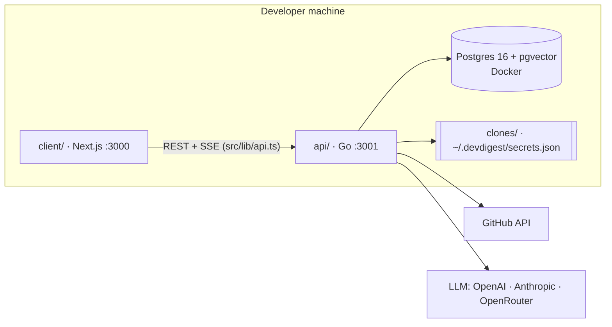
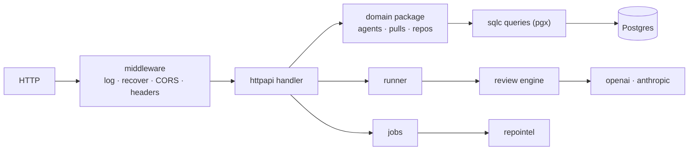

# DevDigest onboarding

You are onboarding a **new engineer** to this repository. Your job is to give them
an accurate mental model in ~15 minutes of reading, then point them at the code to
read next. Write for a competent developer who has never seen this repo; the
backend is Go, the web app TypeScript.

## Ground rules

1. **Verify before you state.** The "Baseline" section below is a snapshot and
   may be stale. Before putting any fact in your answer (a port, a file path, a
   module name, a table, a dependency), confirm it with `ls`, `grep`, or by
   reading the file. If the code disagrees with the baseline, trust the code and
   say what changed.
2. **Cite files** as `path/to/file.go` (with `:line` where useful) so the reader
   can click through.
3. **Explain the *why*,** not only the *what* — e.g. why `internal/review`
   imports no HTTP, SQL or SDK package, why grounding exists, why the migrations
   keep Drizzle's bookkeeping.
4. **Don't dump the READMEs.** Synthesize; link to them for depth.
5. Reply in the language the user wrote in.

## Output structure

Produce these sections, in this order:

1. **What DevDigest is** — goal and purpose in 3–5 sentences (who uses it, what
   problem it solves, what "local-first" means here, that this is a course
   starter that later lessons extend).
2. **Tech stack** — a table: layer → technology → where it lives.
3. **Repository layout** — an annotated tree of the top-level folders and the
   important sub-folders (no more than ~40 lines).
4. **How the parts connect** — a Mermaid diagram of the API, the web app and
   external systems, then how they share a contract (the HTTP JSON, described
   by Zod schemas in the client).
5. **Inside the API** — a Mermaid diagram of request → middleware → handler →
   domain package → sqlc queries / adapters, plus a table of the Go packages
   and what each owns.
6. **The core flow, end to end** — a Mermaid `sequenceDiagram` for
   *add repo → clone → index → import PRs → run review → findings in UI*.
7. **Data model** — the main tables grouped by domain, and which ones are empty
   in the starter (filled by later lessons).
8. **Running it locally** — the minimal commands, and the gotchas from
   "Known sharp edges" that are still true (re-check each one).
9. **Testing & CI** — suites, how database tests get Postgres, workflows.
10. **Where to start reading** — an ordered reading path of 8–10 files, one line
    each on why.
11. **First-week tasks** — 3–5 small, concrete starter tasks tied to real code.

Keep diagrams small enough to read (≤ ~15 nodes each). Prefer several focused
diagrams over one giant one.

## Baseline (snapshot — verify before use)

### Purpose

DevDigest is a **local-first AI pull-request reviewer**. A developer adds a
GitHub repo, the server clones and indexes it, imports open PRs, and runs one or
more **agents** (an LLM + system prompt) over a PR diff. The output is
**structured findings** (severity, score, cited line) that pass a mechanical
**grounding gate** so hallucinated locations are dropped. Everything runs on the
developer's machine; the only outbound calls are GitHub and the LLM provider.
This repo is the **course starter**: it does one flow end to end, and each lesson
(L01–L08 in `README.md`) adds a feature back as a new server module.

### Parts (no monorepo workspace — each has its own toolchain)

| Folder | Package | Role | Port |
|---|---|---|---|
| `api/` | Go module | HTTP API, review engine, repo-intel, migrations, seed | 3001 |
| `client/` | `@devdigest/web` | Next.js 15 studio UI (pnpm) | 3000 |
| `client/src/vendor/shared` | `@devdigest/shared` | Zod contracts of the API's JSON | — |
| `client/src/vendor/ui` | `@devdigest/ui` | Vendored UI primitives | — |
| `e2e/` | `@devdigest/e2e` | Deterministic browser e2e (agent-browser) | — |

The backend was TypeScript (`server/`, Fastify, and `reviewer-core/`) until the
Go rewrite; `git show ts-final:<path>` reads it. The API kept its routes and
JSON, so the client talks to Go without knowing. `api/CLAUDE.md` has the Go
code rules; `api/README.md` has every package and each deviation from TS.

### Tech stack

- **API:** Go (version in `api/go.mod`), standard library `net/http` routing,
  `pgx` + `sqlc` (queries in `api/internal/postgres/queries/*.sql`), Postgres 16 +
  pgvector (Docker), tree-sitter via cgo (TS/JS symbols), `tiktoken-go`, the
  official Anthropic Go SDK; OpenAI/OpenRouter and GitHub clients on `net/http`.
- **Client:** Next.js 15 App Router, React 19, TanStack Query, `next-intl`,
  Tailwind 4, `recharts`, `mermaid`, `react-markdown`.
- **Tests:** `go test -race` with testcontainers Postgres (`api/internal/pgtest`);
  Vitest + `@testing-library/react` + jsdom (client); agent-browser (e2e).
- **CI:** `.github/workflows/{api,client,e2e-web}.yml`, path-filtered.

### Package map



### API internals (`api/`)

- Entry: `api/cmd/api/main.go` builds every dependency (pool, secrets, runner,
  jobs, repos store) and passes them into `httpapi.New` — no DI container.
  `cmd/db` migrates and seeds; `cmd/review` reviews a diff from the shell.
- Routes: `api/internal/httpapi/server.go` (`Handler`), one file per area
  (`repos.go`, `pulls.go`, `agents.go`, `reviews.go`, `runs.go`,
  `settings.go`, …); middleware in `middleware.go` (CORS, security headers,
  panic recovery, request log).
- Domain packages: `internal/review` (engine), `internal/diff`,
  `internal/agents`, `internal/pulls`, `internal/repos`, `internal/repointel`.
  Adapters: `internal/openai`, `internal/anthropic`, `internal/github`,
  `internal/git`, `internal/secrets`. Interfaces are defined where they are
  used (e.g. `review.LLM`).
- **Async work:** `internal/jobs` (3 at a time, 2 min each, recorded in the
  `jobs` table) runs clone → index; `internal/runner` runs reviews in the
  background and streams each run's live log over SSE (`/runs/{id}/events`).
- **repo-intel** (`internal/repointel`): tree-sitter symbols and references →
  import graph → PageRank → repo map, stored in Postgres; a review reads the
  map, file ranks and callers. Gated by `REPO_INTEL_ENABLED` and a per-agent
  `repo_intel` flag.



### Review engine (`api/internal/review/`)

`run.go` (`Run`: one call, or one per file for big diffs, then `merge`) →
`prompt.go` (`Prompt.Assemble`, `untrusted` wrapping, `injectionGuard`) → the
`LLM` interface → `structured.go` (JSON Schema `review.schema.json`, retry when
the answer is invalid) → `grounding.go` (`Ground`: drop findings whose lines
aren't in the diff) → `score` recomputed from the survivors. It imports no
HTTP, SQL or SDK package; the runner (`internal/runner`) feeds it the diff and
the repo-intel context.

### Client (`client/src/`)

Routes in `src/app/**/page.tsx`: `/`, `/onboarding`, `/repos/[repoId]/pulls`,
`/repos/[repoId]/pulls/[number]` (overview · diff · findings · run trace),
`/agents`, `/agents/[id]`, `/settings/[section]`. Data hooks in
`src/lib/hooks/*` over `src/lib/api.ts` (`NEXT_PUBLIC_API_BASE`). Feature UI is
colocated in `_components/<Name>/` with a sibling `*.test.tsx`. Shell/nav in
`src/components/app-shell`, diff UI in `src/components/diff-viewer`.

### Data model (migrations in `api/migrations/*.sql`)

The schema already contains **every** course table; many are empty in the
starter. Group them by domain (core, repos, pulls, agents, reviews, runs,
repo-intel, skills, knowledge, context, eval, ci, ops) and mark which ones the
starter actually writes (grep `INSERT INTO` / `UPDATE` in
`api/internal/postgres/queries/*.sql`). The TS Drizzle schema, with one file per
domain, is at `ts-final:server/src/db/schema/`.

### Known sharp edges (re-verify each; drop any that are fixed)

- **Postgres is on host port 5433, not 5432** (`docker-compose.yml`), so it
  doesn't clash with a native Postgres. `api/.env.example`, the API's default
  `DATABASE_URL` and CI all use 5433; the hermetic e2e stack
  (`scripts/e2e.sh`) uses 5434.
- **Migrations don't run on boot** — `api/bin/db migrate` (or
  `go run ./cmd/db migrate` in `api/`) is required; `scripts/dev.sh` does it.
- **The API doesn't read `api/.env` itself** — `scripts/dev.sh` loads it.
  Started by hand, the API sees only the shell's environment.
- **Building needs cgo** (tree-sitter) and a C compiler.
- **Secrets are not in the DB or `.env` only** — `internal/secrets` reads
  `~/.devdigest/secrets.json` first, then the environment.
- **The contracts live only in the client** (`client/src/vendor/shared`): a
  JSON change in the API must be mirrored there by hand.
- **Database tests skip without Docker** (`internal/pgtest`), so a green
  `make check` without Docker running tested less than it seems.

### Local run

```sh
./scripts/dev.sh            # Postgres (Docker) → env files → build → migrate → seed → API + web
# flags: --no-seed · --no-client · --db-only
```

Open http://localhost:3000. Seed data: `acme/payments-api`, PR #482, two built-in
agents (General + Security).

## After writing

End with a one-line offer to publish the guide as a shareable HTML page, and list
any baseline facts you found to be out of date so the maintainer can update this
skill.
