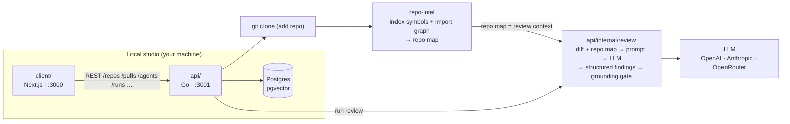

# DevDigest — starter

Local-first AI pull-request review. This is the **course starter template**: a
minimal-but-working tool that does exactly one thing end to end — **import a PR
and run an agent review on it**. Every later course lesson adds one feature back
(see [_What you build in the course_](#what-you-build-in-the-course)).

Three standalone parts, each with its own toolchain (no monorepo workspace):

| Folder    | Package          | What it is                                            | Port |
|-----------|------------------|-------------------------------------------------------|------|
| `api/`    | Go module        | The API: Postgres (pgvector), repo-intel, the review engine ([README](api/README.md)) | 3001 |
| `client/` | `@devdigest/web` | Next.js 15 web app (the studio)                       | 3000 |
| `e2e/`    | `@devdigest/e2e` | Deterministic browser e2e (agent-browser)             | —    |

The API's JSON contracts, as Zod schemas, live in the client at
`client/src/vendor/shared` (`@devdigest/shared`). `repo-intel` (the codebase
indexer that powers the **Indexed** badge and feeds project context into
reviews) is [`api/internal/repointel`](api/internal/repointel); the review
engine is [`api/internal/review`](api/internal/review). Only **Postgres** runs
in Docker; the API and web app run on the host.

The backend used to be TypeScript (`server/`, Fastify, and `reviewer-core/`).
It was removed after the Go rewrite; the last commit that has it is
`e9e4574` (tag `ts-final`).

## Architecture



The review flow end to end: **add a repo** → the API clones it and `repo-intel`
indexes it (the **Indexed** badge) → **import PRs** from GitHub → open a PR and
**Review** → the review engine assembles a prompt from the diff + the repo map,
calls the LLM, validates every finding against the diff (the **grounding gate**
drops hallucinated line references), and persists structured findings with a
severity and score. All local; the only outbound calls are to GitHub (PR data)
and the LLM (via OpenRouter).

Each part has its own README:
[`api`](api/README.md) (packages, routes, deviations from the TS server) ·
[`client`](client/README.md) (UI route map) ·
[`e2e`](e2e/README.md).

## What works on day 1

- **Local launch** — one command brings up Postgres (Docker) + API + web.
- **Settings** — store your LLM API key (OpenAI / Anthropic) and GitHub token.
- **Add repository** — paste a repo URL; the API clones and indexes it.
- **Import pull requests** — pull open PRs and their diff, commits, body, and linked issue.
- **View diff** — GitHub-like diff in the browser.
- **Agents** — two built-in reviewers (General + Security); create/edit your own (model + system prompt).
- **Run a review** — single-pass analysis returning structured findings (severity + score), with the grounding gate and repo-map context working from the start.

## What you build in the course

These are intentionally **not** in the starter — each lesson adds one back:

| Lesson | You build |
|--------|-----------|
| L01 | Run cost badge · severity filter on findings |
| L02 | Skills in the product · Conventions extractor |
| L03 | Intent layer · Smart Diff |
| L04 | `devdigest-mcp` server · Blast Radius (reads `repo-intel`) |
| L05 | Project Context Folder · Onboarding generator · PR Brief card |
| L06 | Eval pipeline · Secret/Phantom gates · Plan Verifier · Export to CI |
| L07 | Multi-agent review · Run Trace / Live Log · Persistent memory · per-agent stats |
| L08 | Plugin export/import · Agent performance dashboard · weekly digest |

## Prerequisites

- **Go** (the version in `api/go.mod`) and a C compiler (cgo, for tree-sitter)
- **Node** ≥ 22 · **pnpm** ≥ 10 (`npm i -g pnpm`), for the web app · **Docker** (for Postgres)

## Quick start (from zero)

```sh
./scripts/dev.sh
```

This script:
1. starts Postgres (`docker compose up -d`) and waits until it's healthy,
2. creates `api/.env` and `client/.env` from `.env.example` if missing,
3. builds the Go API (`api/bin`) and installs deps in `client/` (only when
   `node_modules` is absent),
4. applies DB migrations and seeds demo data (`api/bin/db`),
5. launches the Go API (`:3001`, with `api/.env` loaded) and the web app (`:3000`).

Open **http://localhost:3000**. Press **Ctrl-C** to stop the dev servers —
Postgres keeps running (`docker compose down` to stop it).

Flags: `--no-seed` · `--no-client` · `--db-only` · `--help`.

> Add your keys in `api/.env` (`OPENAI_API_KEY` / `ANTHROPIC_API_KEY`,
> `GITHUB_TOKEN`) or via the Settings UI at runtime.

## Manual steps (what the script does)

```sh
docker compose up -d                                   # Postgres + pgvector

cd api && make build     # bin/api, bin/db, bin/review
./bin/db migrate         # apply migrations (NOT run automatically on boot)
./bin/db seed            # idempotent demo data (optional)
(set -a; . ./.env; set +a; ./bin/api)   # API on :3001, with api/.env

cd ../client && pnpm install && pnpm dev               # web on :3000
```

## Useful scripts

`api/`: `make build` · `make check` (gofmt, vet, staticcheck, tests) · `make generate` (sqlc)
`client/`: `dev` · `build` · `start` · `test` · `typecheck`

## Testing & CI

One test suite per package, each gated by its own GitHub Actions workflow with a
path filter — full strategy in **[`TESTING.md`](TESTING.md)**.

| Suite | Workflow | Needs Docker |
|-------|----------|--------------|
| api (Go: vet, staticcheck, tests) | `api.yml` | yes |
| client (vitest + jsdom) | `client.yml` | no |
| web e2e (agent-browser, real stack) | `e2e-web.yml` | yes |

The Go database tests start Postgres with testcontainers. The browser e2e flows live in
[`e2e/`](e2e/README.md) and run deterministically (no LLM).

## Troubleshooting

- **`relation ... does not exist` / API errors on first run** — migrations weren't
  applied. The API does **not** migrate on boot: run `cd api && go run ./cmd/db migrate`.
- **Port 5433 already in use** — Docker Postgres is published on host port `5433`
  (not `5432`, so it doesn't clash with a native Postgres). If something else holds
  5433, change the host port in `docker-compose.yml` **and** `DATABASE_URL` in
  `api/.env` to match.
- **`vector` type errors** — the migrator (`api/cmd/db migrate`) enables the
  pgvector extension before applying the migrations; the migration files
  themselves don't. Make sure you migrated with it, against the Dockerized DB
  (it ships pgvector), not a different one.
- **Reset everything** — `docker compose down -v` drops the volume, then re-run
  `./scripts/dev.sh`.
