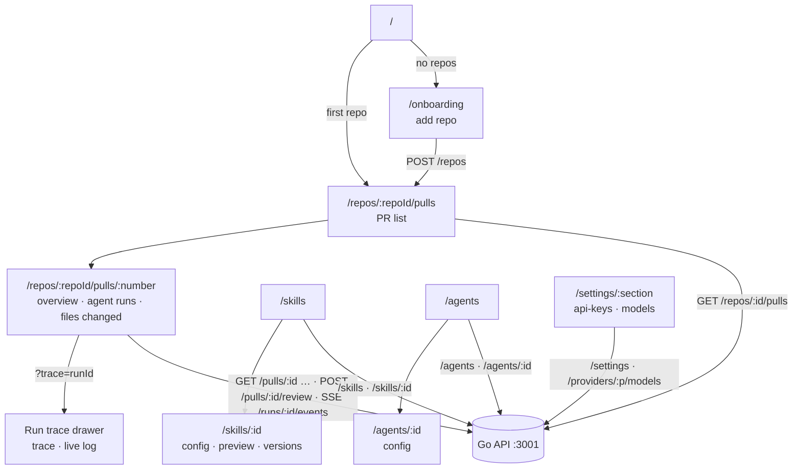

# Route map

Routes live in `src/app/**/page.tsx`. Every page is wrapped in `AppShell` (nav, breadcrumbs,
⌘K palette, `g p` / `g a` shortcuts, from `src/components/app-shell`).

| Route | Screen | URL state | API calls (through `src/lib/hooks`) |
|---|---|---|---|
| `/` | Redirects to the first repo's PR list, or offers onboarding | — | `GET /repos` |
| `/onboarding` | Add a repository (URL only). Esc closes | — | `POST /repos` |
| `/repos/:repoId/pulls` | PR list: search, status chips, sort, refresh | `?status=` (default `needs_review`) | `GET /repos/:id/pulls`, `POST /repos/:id/refresh` |
| `/repos/:repoId/pulls/:number` | PR detail: Overview · Agent runs · Files changed | `?tab=overview\|findings\|diff`, `?trace=<runId>` | `GET /pulls/:id`, `/reviews`, `/runs`, `/runs/active`, `/comments`; `POST /pulls/:id/review`, `/comments`; `GET /runs/:id/events` (SSE), `/trace`; `POST /runs/:id/cancel`; `DELETE /runs/:id`, `/reviews/:id`; `POST /findings/:id/accept\|dismiss` |
| `/skills` | Skill list; create, enable, delete a skill | — | `GET /skills`, `POST /skills`, `PUT /skills/:id`, `DELETE /skills/:id` |
| `/skills/:id` | Skill editor: Config · Preview · Versions | `?tab=config\|preview\|versions` | `GET /skills/:id`, `/versions`, `/agents`; `PUT /skills/:id`; `POST /skills/:id/versions/:v/restore` |
| `/agents` | Agent cards; create an agent | — | `GET /agents`, `POST /agents` |
| `/agents/:id` | Agent editor (Config tab only in the starter) | `?tab=` | `GET /agents/:id`, `PUT /agents/:id`, `GET /providers/:p/models` |
| `/settings/:section` | `api-keys` · `models` (feature models) | the section | `GET /settings/secrets-status`, `POST /settings/test-connection`, `GET/PUT /settings`, `GET /providers/:p/models` |

`:number` is the PR number. The PR APIs take the PR's UUID, so the detail page finds it in the
cached PR list first. An unknown `:repoId` renders `RepoNotFound` instead of an error.

